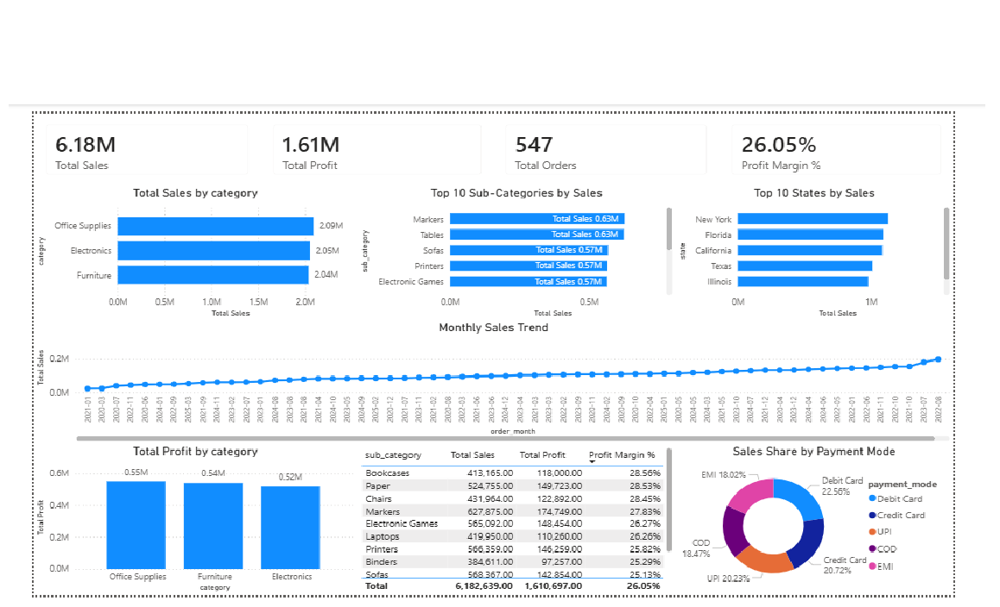

# Sales Analysis Dashboard (SQL + Power BI)

## Project Overview
This project analyzes sales data using SQL for data preparation and Power BI for visualization.

## Tools Used
- MySQL
- SQL
- Power BI

## Key Analysis
- Sales and profit by category
- Top 10 sub-categories by sales
- Monthly sales trend analysis
- State-wise sales performance
- Payment mode contribution
- Profit margin analysis

## Dashboard Preview

## Key Insights
- Office Supplies generated the highest sales
- Bookcases and Paper have the highest profit margins
- Sales show a clear monthly trend
- Digital payment modes contribute majority of revenue

